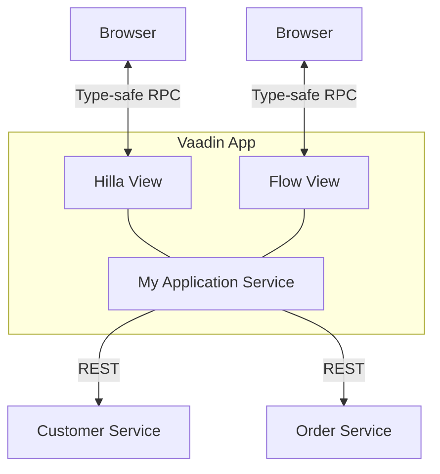

# Example Vaadin microservice application

This example application demonstrates how to use Flow and Hilla to call microservices.
Hilla follows a backends-for-frontends pattern, where each frontend has its own backend. Flow is orchestrating the result of different Backend Services
The frontend is responsible for aggregating data from multiple services and presenting it to the user.

Hilla and Flow use type-safe RPC calls to communicate between the frontend and backend.

The example consists of 3 applications:
- `user-service` - A service that provides user data
- `order-service` - A service that provides order data
- `vaadin-app` - The frontend application that aggregates data from the other services
  - `hilla-view` - view with TypeScript Frontend und Java Backend
  - `flow-view` - view that implements the UI fully in Java

## Running the example
You can either run the example locally or in a Docker container.

- Run the example locally by running the Spring Boot application in each folder.
- Run the example in Docker by running `docker-compose up (--build)` in the root folder.